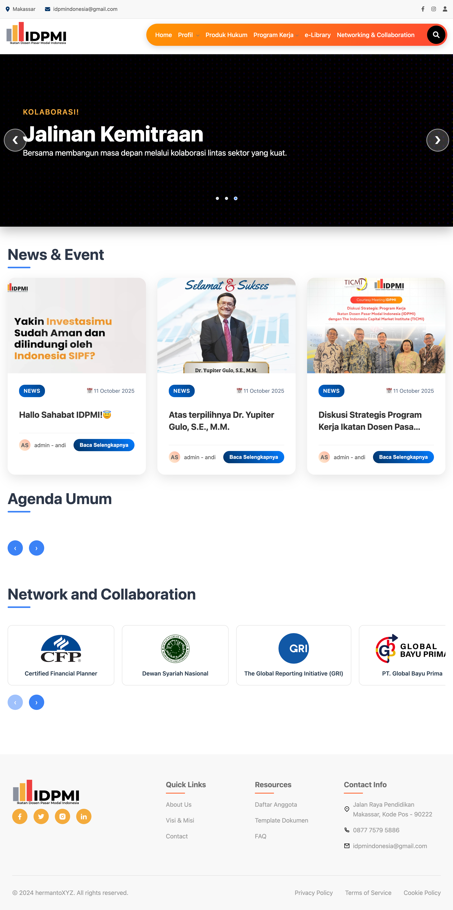
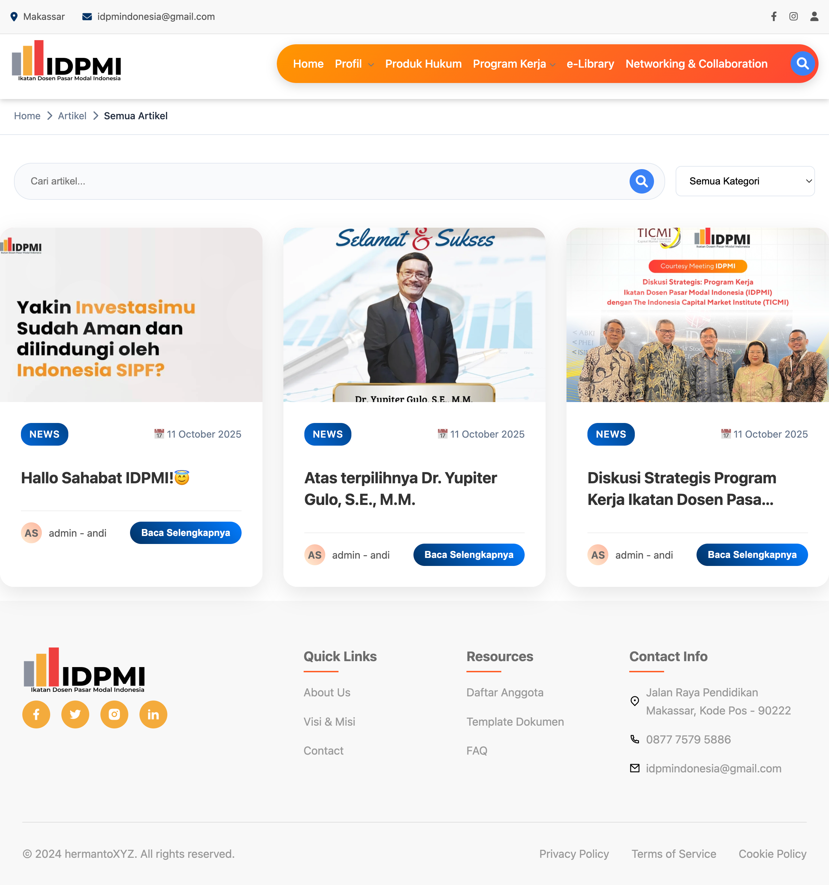
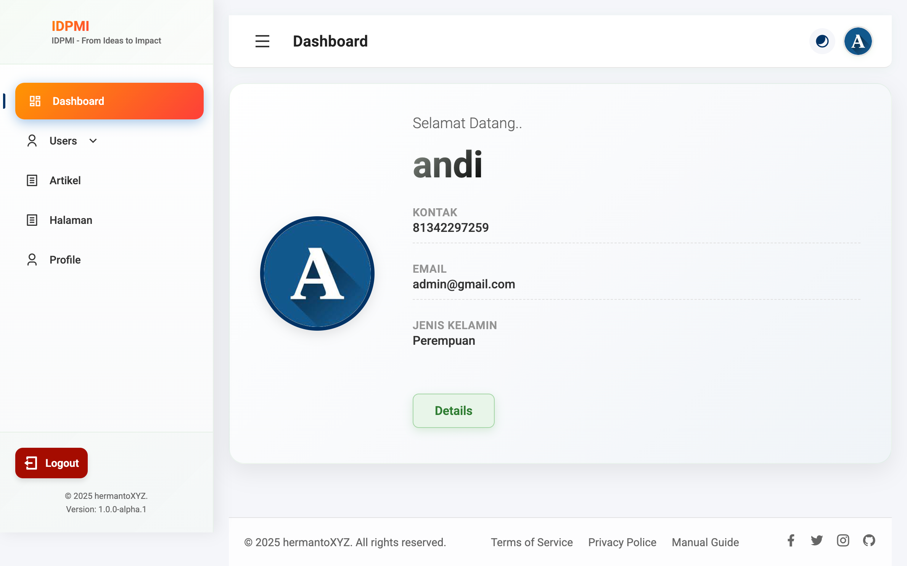
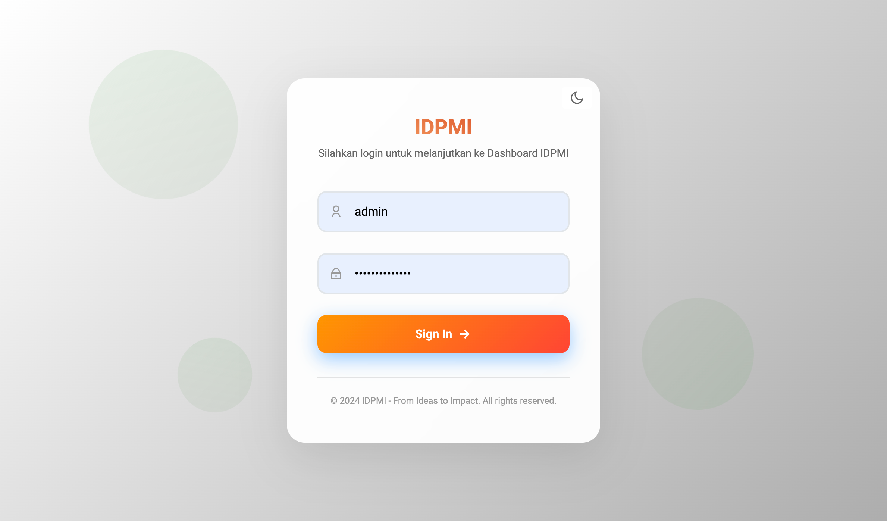

# 🌐 IDPMI - Ikatan Dosen Pasar Modal Indonesia

Selamat datang di repository website **IDPMI (Ikatan Dosen Pasar Modal Indonesia)**.  
Website ini dikembangkan sebagai portal digital resmi bagi para dosen, peneliti, dan praktisi pasar modal di Indonesia untuk berkolaborasi, berbagi pengetahuan, serta mengelola kegiatan organisasi secara profesional dan terintegrasi.

---

## 🚀 Tujuan Proyek

Platform ini dirancang untuk:
- Menjadi wadah komunikasi dan kolaborasi antar dosen pasar modal di Indonesia.  
- Menyediakan informasi terkini seputar kegiatan IDPMI, berita pasar modal, dan artikel akademis.  
- Menjadi pusat data keanggotaan, dan publikasi anggota IDPMI.  
- Mendukung tata kelola organisasi IDPMI yang lebih modern

---

## 🧩 Fitur Utama

### 👤 **Manajemen Pengguna**
- **Multi-role system**:
  - **Admin**: mengelola seluruh data, pengguna, dan konten.
  - **Anggota / Dosen**: mengelola profil dan keanggotaan
  - **Publik**: dapat mengakses berita, artikel, dan direktori.
- Registrasi & autentikasi menggunakan sistem Django Authentication.
- Profil pengguna lengkap: biodata, foto dll


### 📰 **Portal Berita & Publikasi**
- Modul **PostNews** untuk menampilkan berita terkini IDPMI.
- Kategori artikel dan berita berdasarkan topik pasar modal, ekonomi, dan pendidikan.
- Tampilan berita dengan thumbnail, slug URL otomatis, dan SEO friendly.


### 🏛️ **Organisasi & Keanggotaan**
- Struktur organisasi IDPMI ditampilkan secara dinamis.
- Modul **Organisasi** untuk menampilkan dewan pengurus dan bidang kerja.
- Data keanggotaan dikelola melalui modul **UserAnggota**.


---

## 🧱 Teknologi yang Digunakan

| Kategori | Teknologi |
|-----------|------------|
| Framework | Django 5.x |
| Database | MySQL (via XAMPP atau server production) |
| Frontend | HTML5, CSS3, JavaScript |
| Template Engine | Django Template |
| Admin Panel | Custume theme HermantoXYZ |
| Tagging System | django-taggit |
| Import/Export Data | django-import-export |
| Authentication | Django Auth System |
| Version Control | Git & GitHub |

---

## 🧭 Struktur Proyek

```

idpmi/
├── app/                # Aplikasi utama Django
├── capture/            # Folder untuk menyimpan screenshot (opsional)
├── requirements.txt    # Daftar dependencies Python
├── README.md           # Dokumentasi proyek ini
├── static/             # File CSS, JS, dan gambar statis
├── templates/          # Template HTML
├── core/               # Pengaturan utama Django (urls, settings)
└── manage.py           # Skrip manajemen Django

````

---

## ⚙️ Instalasi & Konfigurasi

### 1. Clone Repository
```bash
git clone https://github.com/username/idpmi.git
cd idpmi
````

### 2. Buat Virtual Environment

```bash
python -m venv env
source env/bin/activate  # macOS / Linux
env\Scripts\activate     # Windows
```

### 3. Install Dependencies

```bash
pip install -r requirements.txt
```

### 4. Konfigurasi Database

Edit file `settings.py`:

```python
DATABASES = {
    'default': {
        'ENGINE': 'django.db.backends.mysql',
        'NAME': 'idpmi_db',
        'USER': 'root',
        'PASSWORD': '',
        'HOST': 'localhost',
        'PORT': '3306',
    }
}
```

### 5. Migrasi Database

```bash
python manage.py makemigrations
python manage.py migrate
```

### 6. Jalankan Server

```bash
python manage.py runserver
```

Akses di: [http://127.0.0.1:8000](http://127.0.0.1:8000)

---

## 🔐 Login Default (Development)

| Role  | Username | Password |
| ----- | -------- | -------- |
| Admin | admin    | admin |

---

## 📊 Screenshot (opsional)

> Tambahkan tangkapan layar halaman dashboard, direktori pakar, dan berita di sini jika sudah tersedia.

[](capture/127.0.0.1_8000_.png)  
[](capture/127.0.0.1_8000_article_.png)  
[](capture/127.0.0.1_8000_article_hallo-sahabat-idpmi_.png)
[](capture/127.0.0.1_8000_dashboard_.png)  
[](capture/127.0.0.1_8000_login_.png)


---

## 🤝 Kontributor

* **Andi Hermanto** – Developer utama
* Tim IT & Riset IDPMI
* Komunitas Dosen Pasar Modal Indonesia

---

## 💬 Kontak

📧 Email: [idpmindonesia](mailto:info@idpmi.or.id)
🌍 Website: [https://idpmi.or.id](https://idpmi.or.id)


---

> *"Bersama membangun ekosistem pasar modal yang akademis, inklusif, dan berintegritas."*
> **— IDPMI (Ikatan Dosen Pasar Modal Indonesia)**

